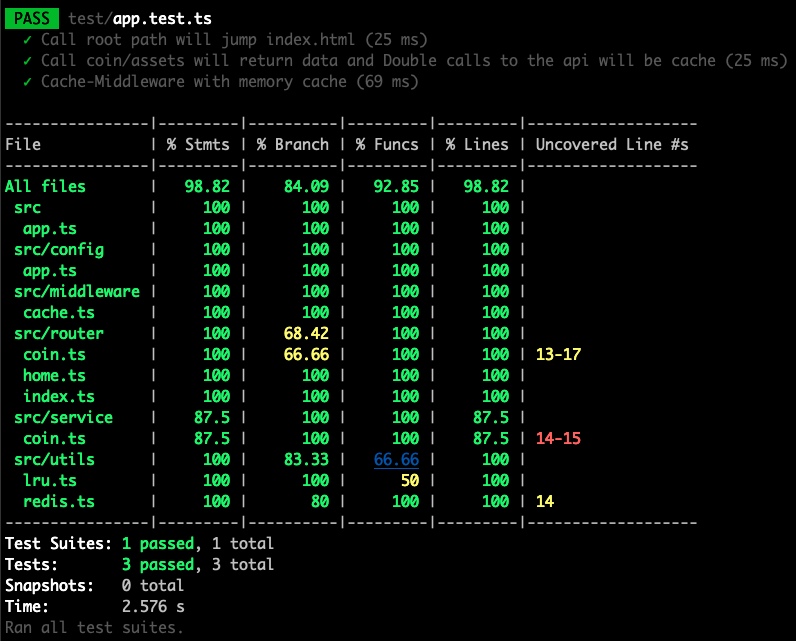

# Real-time Cryptocurrency Monitor

> A simple real-time application which monitors the prices of cryptocurrencies.

## Architecture Design


1. Setup api server (koa + ts)

   - static resource access

   - coin asserts api interface (with cache logic)

2. Set web project (vite + react + ts)

   - single page, display the prices of cryptocurrencies.

   - interval request server provides coin asserts interface

3. Consideration

   - About project structure

   ```
   ├── README.md
   ├── api
   │   ├── main.ts                 # server entrance
   │   ├── src
   │   │   ├── app.ts
   │   │   ├── config
   │   │   ├── middleware
   │   │   ├── router
   │   │   └── service
   │   └── test                    # server unit test
   ├── web
       ├── src
       │   ├── Components
       │   ├── hooks
       │   ├── main.css
       │   └── main.tsx            # web entrance
       ├── test                    # web unit test
       └── vite.config.ts
   ```

   - About Cache using [koa-cash](https://github.com/koajs/cash) Currently, in memory store is used, which is conducive to extension to use Redis and more.

   - About Rendering a large data usinig [react-window](https://github.com/bvaughn/react-window) It reduces the amount of work (and time) required to render the initial view.

   - About web adapted for different size devices.

## Preview

1. Summary


```
# clone project
git clone git@github.com:xiguan00yu/real-time-cryptocurrency-monitor.git

# into project
cd real-time-cryptocurrency-monitor

# install, Don't worry that it will install API and web dependencies
npm i

# build web and run server
npm run preview

# If you see output like this, it means that you are ready to access A
# `listen http://localhost:3000`
# `vite v3.2.3 building for production...`
# `...`

# browser input url: http://localhost:3000
```

## Unit Test (jest)

1. api project coverage

```
# path: real-time-cryptocurrency-monitor
# into api folder
cd api

# install
npm i

# test
npm run test
```



2. web project coverage

```
# path: real-time-cryptocurrency-monitor
# into web folder
cd web

# install
npm i

# test
npm run test
```


